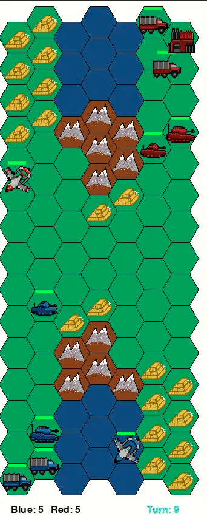
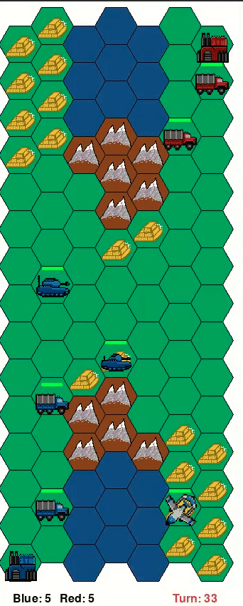
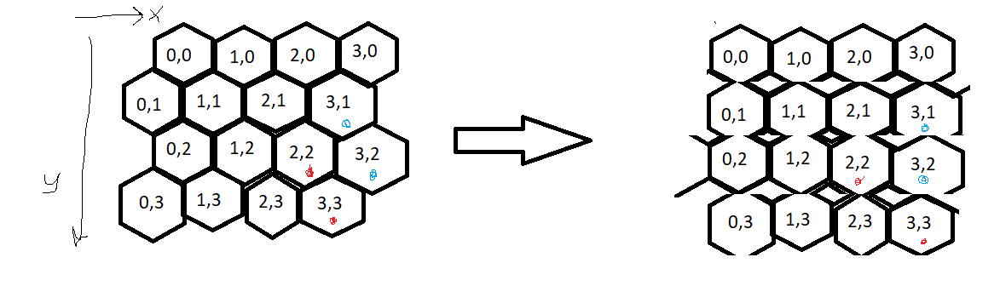
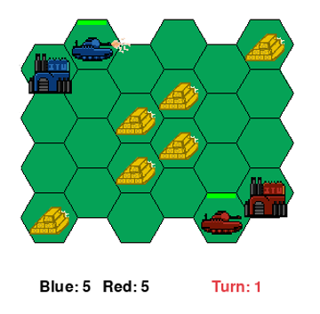
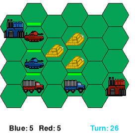
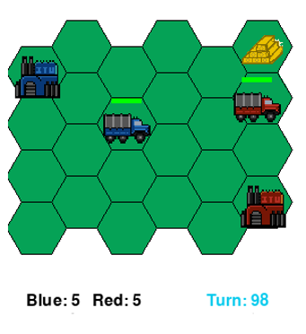
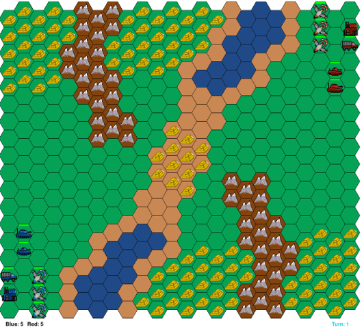

# DRL-Competition 2024
A turn based strategy simulation game for competing Deep Reinforcement Learning (DRL) agents. It has complex dynamics such that the state-of-the-art methods can be compared meaningfully while computationally being simple that it doesn't take a lifetime to complete a DRL training.

&nbsp;

Attack           |  Collect  |
:-------------------------:|:-------------------------:
  | 

&nbsp;

The objective of the game is to have more resources than your opponent when the time ends. The score is calculated as `(your resources) - (opponent's resources)` at the end of the game. As it can be clearly seen; getting positive scores means you have won, negative scores mean you have lost, and lastly getting a 0 score means the game was a tie.

## How to Install
`git clone https://github.com/DRL-ITU-2024/DRL-Competition`

Make sure that Python packages in `requirements.txt` are installed. Also please make sure to install the following versions of the given libraries:

- `Python==3.9.5`
- `pytorch==1.11 with cudatoolkit=10.2`
- `tensorflow==2.8.0`

The game is developed for Linux Operating System (OS) and might not work on other OS (definitely does not work on Windows, untested on Mac). If the game does not work on your machine's OS, you need to deploy a virtual machine. You can deploy the Docker Container with the help of the `Dockerfile` given in the repository.

You don't have to install both PyTorch and Tensorflow, But if you install any of them, you need to make sure to install the versions specified above. You can change the `requirements.txt` file and `Dockerfile` accordingly.

## How to Run

### Single to Run

`python src/sb3cadet.py "map" "agentBlue" "agentRed"`

Example run: `python src/sb3cadet.py RiskyValley --agentBlue RiskyValley --agentRed RandomAgent`

You can use examples given for a StableBaselines3 agent with `src/sb3cadet.py` or a Ray-Rllib agent with `src/traincadet.py` for your training. 

HINT: You do not have to give both of the agents every time if you define them beforehand in `src/sb3cadet.py` or `src/traincadet.py`. Please read the parsed arguments in these files carefully and change them accordingly.

## Gym

### State

State representation is the knowledge from the game that is being send to agents when it is their turn.

State includes following members:

`score = int, shape(2)`

`turn = int, shape(1)`

`max_turn = int, shape(1)`

`units = int, shape(y,x)`

`hps = int, shape(y,x)`

`bases = int, shape(y,x)`

`res = int, shape(y,x)`

`load = int, shape(y,x)`

Example state decoding: 

`score = state['score']`

`turn = state['turn']`

`max_turn = state['max_turn']`

`units = state['units']`

`hps = state['hps']`

`bases = state['bases']`

`res = state['resources']`

`load = state['loads']`

### Action

`[location, movement, target, train]`

Location (y,x) Tuple

IMPORTANT: Notice that the coordinates are (y,x) rather than (x,y). This is purely a conventional choice, and a standard on wargames.

Movement: 0-6 where 1 to 6 are movement actions with the direction given in the image, and 0 is the shoot or collect actions

Target: (y,x) Tuple

Train: 0-4 where 0 is no action, 1 is train truck, 2 is train light tank, 3 is train heavy tank, and 4 is train drone.

Order of processing the action is done by the order returned from the agent (FIFO).

## Game

### Grid World

Grid world representation: 

### Units

The game involves four units:
- HeavyTank
- LightTank
- Truck
- Drone

Unit rules can be changed in `data/config/rules.yaml` in case it is beneficial for your training. Currently given rules will be used in the competition. Dangerous to touch if you are not sure what you are doing.

  

&nbsp; 

  

## Maps

Maps are defined as Yaml files in `data/config`.

There are currently some maps available:
- demo
- ResourceRiver
- RiskyValley
- GolKenariVadisi

Along with some toy maps (1 or 2 units, tiny dimensions).

  

&nbsp; 

Toy Env 1           |  Toy Env 2  |  Toy Env 3  
:-------------------------:|:-------------------------:|:-------------------------:
  |   |  

The competition map is going to be in dimensions (y=18, x=24). Your agent's action and observation (state) spaces should work in these dimensions. The maps RiskyValley (`data/config/RiskyValley.yaml`) is an example of a correct-size competition environment.

If you wish to create your own map, please take `demo.yaml` as a layout.

&nbsp;

  

## Agents

Agents are located in `src/agents` directory. Each Agent has a file with its name and a class definition with its name. 

Each Agent should be a Gym Environment, and thus have the following functions:
- `__init__((self,team,action_lenght)`
- `reset(self)`
- `step(self, action)`
- `close(self,)`
- `render(self,)`

There are currently five agents available in `src/agents/.`:
- HumanAgent
- RandomAgent
- SimpleAgent
- GolKenari
- RiskyValley

If you wish to create your own agent, you can use `TemplateAgent` as a layout.

The agent `src/agents/RiskyValley.py` (not to be confused with the map `RiskyValley.yaml`!) is an example of an agent with a correct-size action and observation spaces. 

Hint: There can be many different representations for the same action and observation space, and a good representation may substantially increase the training quality.

### HumanAgent

HumanAgent is a special agent for testing purposes. This agent gets each action for each unit from a user from the console.

### RandomAgent

RandomAgent generates actions uniformly random.

### SimpleAgent

SimpleAgent only uses `Truck` and `LightTank` units. Other units constantly try to move upward. `Truck` units try to reach the closest resource and when collected a resource moves back to base. `LightTank` units move to their target if the distance is greater than 2 else shoots. Trucks are selected as targets if available.

### GolKenari

GolKenari is a smart agent for map dimensions (15, 7). Can be found in `src/agents/golkenari.py`. Check the code for further details.

### RiskyValley

RiskyValley is a smart agent for map dimensions (18, 24). Can be found in `src/agents/RiskyValley.py`. Check the code for further details.

## Self-Play

Self-Play is using your own agent to compete with itself to possibly learn your agent's weaknesses, exploit them, and learn to defend them. Self-Play is crucial to improve your agent if your agent's performance is converged to some value on the training with bots (non-learning agents). You can find the script for a Self-Play example in `src/agents/SelfPlay.py`, which is done using a Ray-Rllib agent via `src/agents/RiskyValley.py`. You can define the `checkpoint_path` parameter in `src/agents/SelfPlay.py` to define your learned agent. The opponent in this training is fixed, meaning it does not continue learning, while the allied agent is still learning as the training goes on.

## Competition and Submission

The competition is planned to have two stages. In the first stage, each agent is going to face a bot and gather a score to be placed on a leaderboard. These scores on the leaderboard will be manually updated in random intervals after submissions. You won't know which bot or map you will be competing in, other than the dimensions of the map which is (18, 24) where 18 and 24 are the number of hexagonal tiles for vertical and horizontal respectively. The scores will show average points for 30 games on each map.

For the second stage, after the deadline for submissions is reached, at most the best 4 teams will compete against each other, meaning their agents will play against each other in an online event in a tournament fashion.

For the submission, you are asked to submit ALL of the repository, but please also add the most important files in the folder `submission/.`. These files are your training script (example: `src/traincadet.py`), your agent (example: `src/agents/RiskyValley.py`), your model file, and possibly your utilities file (example: `src/agents/utilities.py`).

## Contact

Please open an issue in this GitHub Repository for any questions, problems, or help regarding the competition environment, after you made sure no one opened an issue with the same problem.

For any kind of problem not directly related to the environment such as the competition deadline or the grading, please contact Prof. N. Kemal Üre.

## Developers

&nbsp;

&nbsp;

| Developers |
| -------- |
| Abdullah Cihan AK     |
| Kubilay Kağan KÖMÜRCÜ     |
| Batuhan İNCE     |
| Assoc. Prof. Nazım Kemal ÜRE  |

&nbsp;
